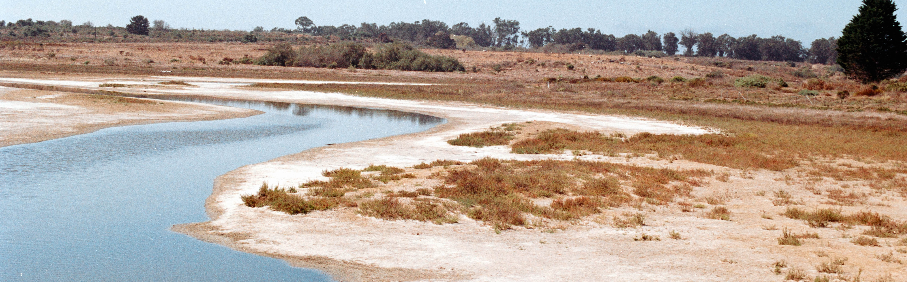

```{r setup, include=FALSE}
knitr::opts_chunk$set(echo = FALSE)
```



# Interests

I identify my work as telmatology – the geographic study of wetlands. More specifically, I study coastal wetland ecosystems from a spatial and temporal lens. My background is in biophysical geography with an emphasis on remote sensing of landscape level processes. I largely research wetland landscape/spatial processes and how wetlands respond to disturbance and environmental change, such as restoration, sea level rise, and seasonality. This is primarily done with observation of plants, but has included soil sampling and experimental treatments. Previous studies have investigated the impacts of drought and debris flow disturbance on long term salt marsh health. My current research focus is on wetland soil salinity and the potential links to salt marsh plant traits. An additional interest of mine is the application and use of experimental and remotely sensed data in managed and restored systems. Lastly, I have a strong interest in how we can develop better data literacy, data systems, and data science for the betterment of the environment and society.

Below are some research projects that I have contributed to.

# Current Projects

## Wetland Soil Salinity Remote Sensing

In collaboration with scientists from NASA/CalTech's Jet Propulsion Lab (JPL), I participated in the SBG High Frequency Timeseries (SHIFT) pathfinder mission for JPL's Surface Biology and Geology Mission that aims to collect plant traits, such as C, N, P content, pigments, leaf-mass-per-area (LMA), *etc*., and relate them to a dense time series of hyperspectral imagery collected by AVIRIS-NG over the Santa Barbara area. My role was the sampling of plants, soils, and spectra for wetlands that fall within the flight path. 

I used the data collected to develop a soil salinity estimating method for wetlands that estimates root depth soil salinity at the landscape scale through the use of machine learning and imaging spectroscopy. I will continue working with data collected from this campaign to gain insights on temporal correlation between different soil salinity and plant traits and compare to experimental data. This has important implications for ecological forecasting and for monitoring and management planning for coastal wetlands. A better understanding of the temporal patterns between salinity and plant trait allows for possible use of predicted future salinity levels to make more accurate future predictions for coastal wetland plant traits and to explore potential approaches and techniques for identifying critical ecosystem thresholds related to salinity. 

## Salt Stress and Plant Traits

In relation to my remote sensing work, I ran a greenhouse experiment to gain insights on the relationship between soil salinity levels and plant traits, especially anthocyanin content. My team of undergraduates and I grew *Salicornia pacifica* (pickleweed) under different salinity treatments (<3, 15, 30 mS/cm) to induce different levels of salt stress and measured the magnitude of the effect salinity has on different plant traits (e.g., chlorophyll and anthocyanin content, leaf-mass-per-area). This information will help improve our understanding of the short-term dynamics of intermittently tidal marsh systems and inform their management. Additionally, this has potential in improving and informing vegetation monitoring plans for coastal wetlands, help in the assessment of vulnerability and migration, and to improve soil salinity estimation models.

# Past Projects

## Bulk Density Effects on Coastal Sage Scrub

Having experienced varying levels of success in establishing self sufficient stands of coastal sagebrush (*Artemsia californica*) at UCSB's NCOS, managers had began to wonder what possible drivers of these differences are. I mentored a McNair Scholar project alongside my advisor, Dr. Jennifer King. The project included collection of soil samples and *Artemsia californica* size measurements across two coastal sagebrush planting zones at NCOS to assess the potential effects of bulk density and soil compaction on the success of coastal sage scrub establishment at UCSB's North Campus Open Space. Results showed that while bulk density did not significantly differ between the two zones, the size of *Artemsia californica* individuals between both zones did. 

## Post-Debris Flow Landcover Change in Carpinteria Salt Marsh Reserve 

For my masters thesis, I investigated how vegetation landcover changed in Carpinteria Salt Marsh Reserve following the 2018 Montecito debris flows. I accomplished this through a time series of Sentinel-2 images and random forest classification methods. After my analysis, I concluded while there was a general trend in green vegetation to pre-debris flow conditions, there was a measurable change in the areal extent of vegetation type with high marsh vegetation transitioning to mid marsh vegetation in regions that initially showed an increase in bare soil cover following the debris flows. These results were uniquely quantifiable using remote sensing techniques and show that disturbance due to debris flows may affect ecosystem function, including decreased primary productivity and decreased resilience to further disturbance. These impacts will need to be taken into consideration when managing wetlands prone to depositional events.