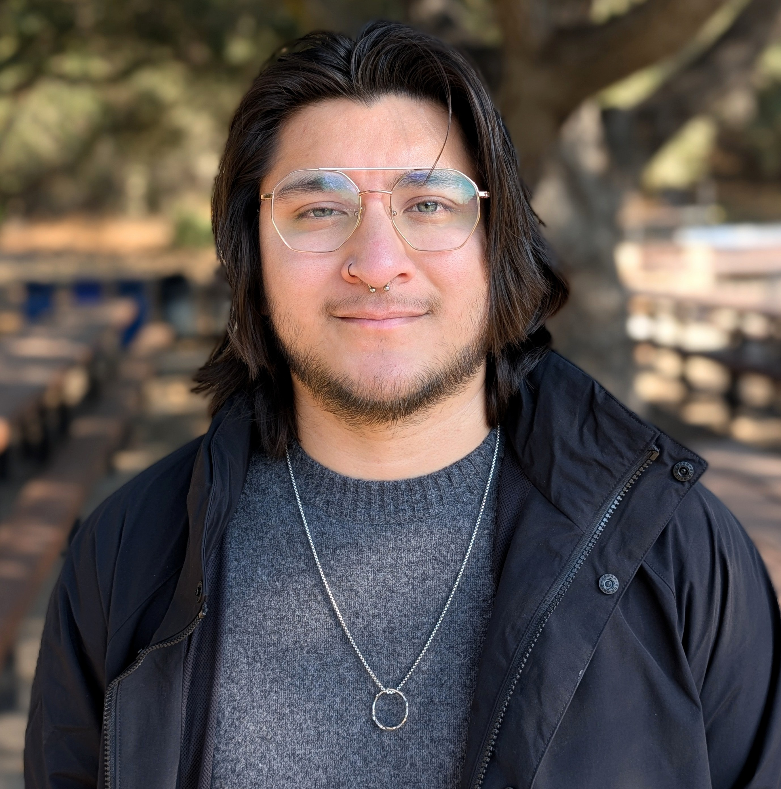

# Principal Investigator 

## Dr. Germán D. Silva

  

 **Ph.D. Geography** UC Santa Barbara (2025) w/   *Interdisciplinary Emphasis in College and University Teaching* 

 **M.A. Geography** UC Santa Barbara (2021) 

 **B.A. Geography** CSU Stanislaus (2019) 

 

 I am a telmatologist with an interest in coastal wetland ecosystems. My background is in biophysical geography with an emphasis on remote sensing of landscape level processes. I largely focus on wetland landscape and spatial response to disturbance and environmental change, how we monitor these responses, and how we create tools and knowledge to advance our understanding of wetland processes for conservation and management goals. I have been studying wetland through remote sensing and field methods for about 10 years and have completed projects that have investigated salinity impacts on wetland plant traits, post-debris flow landcover change, soil influences on upland plant establishment success, and evidence-based innovative pedagogy. When I'm not running around in marshes or hard at work processing images, I can be found doing film photography, cooking, and trying out some good local eats. 

# Lab Members

## Hopefully Coming Soon!

